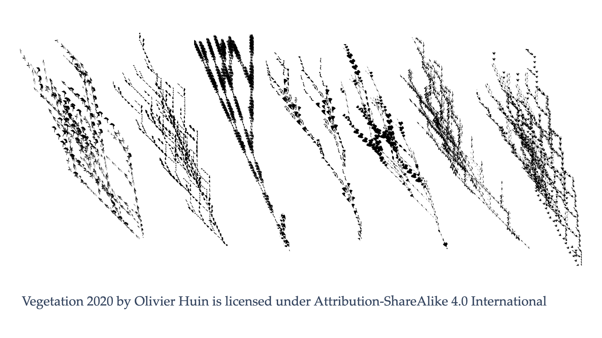

# Stencil
Stencils for illustration

Theses stencils have been created by Olivier Huin with the help of custom made algorithms aka [Evolutionary art](https://en.wikipedia.org/wiki/Evolutionary_art), mostly available in [visual-experiments](https://github.com/olih/visual-experiments)

This work is licensed under Attribution-ShareAlike 4.0 International (CC BY-SA 4.0)

* Share — copy and redistribute the material in any medium or format
* Adapt — remix, transform, and build upon the material for any purpose, even commercially.

Under the following terms:
* Attribution — You must give appropriate credit, provide a link to the license, and indicate if changes were made. You may do so in any reasonable manner, but not in any way that suggests the licensor endorses you or your use.

* ShareAlike — If you remix, transform, or build upon the material, you must distribute your contributions under the same license as the original.

The brushes are available under Attribution 4.0 International.
